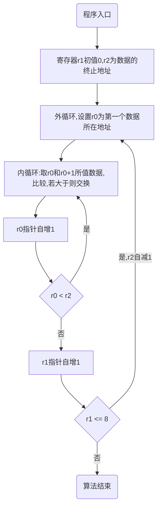

```mermaid
graph TD
begin(程序入口)-->initial[寄存器r1初值0,r2为数据的终止地址]
initial-->outer[外循环,设置r0为第一个数据所在地址]
outer-->inner[内循环:取r0和r0+1所值数据,比较,若大于则交换]-->move[r0指针自增1]-->judge1{r0 < r2}
judge1-->|是| inner
judge1-->|否| remain[r1指针自增1]-->judge2{r1 <= 8}
judge2-->|是,r2自减1| outer
judge2-->|否| END(算法结束)
```